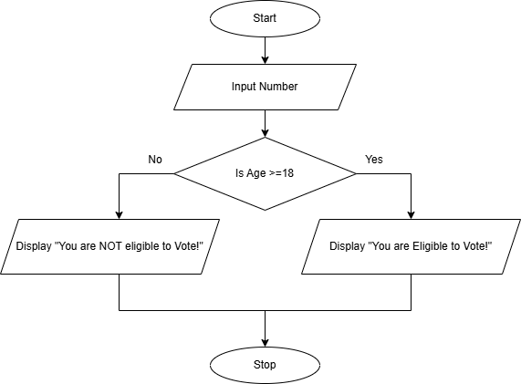
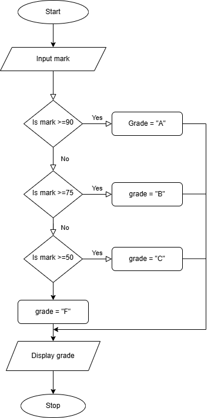
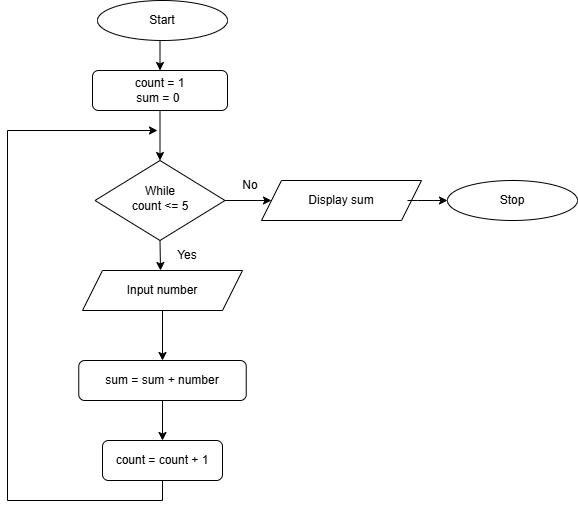
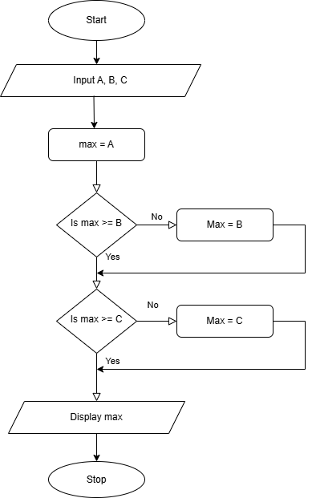

# Algorithm Flowchart Exercise

## 1. A program asks the user to enter their age.

- If the age is 18 or older , display the message "You are eligible to Vote"
- If the age is less than 18 , display the message "You are not eligible to Vote"
- Then end the program.

### Pseudocode

```text
START
    INPUT age
    IF age >=18 THEN
        PRINT "You are eligible to Vote!"
    ELSE
        PRINT "You are not eligible to Vote!"
    ENDIF
END
```

### Flowchart



---

## 2. A program takes a student’s marks (out of 100) as input.

- If marks are 90 or above , display “Grade A
- If marks are between 75 and 89 , display “Grade B
- If marks are between 50 and 74 , display “Grade C
- If marks are below 50 , display F
- End the program.

### Pseudocode

```text
START
    INPUT student_mark
    IF student_mark >= 90 THEN
        grade = "A"
    ELSE IF student_mark >= 75 THEN
        grade = "B"
    ELSE IF student_mark >= 50 THEN
        grade = "C"
    ELSE
        grade = "F"
    ENDIF
    PRINT grade
END
```

### Flowchart



---

## 3. A program that calculates the sum of 5 numbers entered by the user.

- The program should ask the user to enter 5 numbers one by one.
- It should keep a running total of the numbers.
- After all numbers are entered, the program should display the total sum
- Then, end the program

### Pseudocode

```text
START
    SET count = 1, total = 0
    WHILE count <= 5 DO
        INPUT number
        total = total + number
        count = count + 1
    END WHILE
    PRINT sum
END
```

### Flowchart



---

## 4. A program takes three numbers (A, B, and C) as input.

- Determine which number is the largest
- Display the largest number
- End the program.

### Pseudocode

```text
START
    INPUT A, B, C
    SET max_number = A
    IF max_number < B THEN
        max_number = B
    END IF
    IF max_number < C THEN
        max_number = C
    END IF
    PRINT "Largest number is :", max_number
END
```

### Flowchart



---